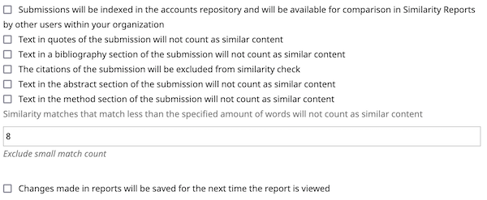

# iThenticate Plagiarism Detector Plugin

For OJS/OMP/OPS 3.x

## Overview

This plugin permits automatic submission of uploaded manuscripts to the [iThenticate service](http://www.ithenticate.com/) for plagiarism checking.
1. You need an account of ithenticate.com (costs involved)
   * paid via Crossref Similarity Check
   * or, paid directly to iThenticate
2. Install the plugin via the Plugin Gallery in the Dashboard
3. Configure the plugin (see below)
   * Enable the plugin via config.inc.php or in a specific journal/press/preprint context
   * Configure the plugin with the **API URL** and **API KEY** you get from ithenticate.com
   * 
4. The author logs in and makes a submission
   * At the Step 4 of submission process, submitting user must need to confirm the iThenticate's End User License Agreement to complete the submission.
   * The submission files will be sent to iThenticate in Step 4 of the submission process
5. The Editor logs in to OJS/OMP/OPS installation, go to the submission list and open the workflow stage for the submission
   * In the submission files grid view, Editor/Journal Manager can see the similarity scores if the similarity process has completed.
   * Editor/Journal Manager can also launch the iThenticate's similarity viewer as an additional action.
6. In addition to all of above, if the auto upload to iThenticate is disable, Editor/Journal Manager and upload each of submission file one by one from the workflow stage.

## Similarity Check Settings

There are several iTheticate similarity check settings that can be configured via the plugin.
1. Similarity Check Options
   * `addToIndex` -- The submission will be added to all valid node groups for future matching
   * `excludeQuotes` -- Text in quotes of the submission will not count as similar content
   * `excludeBibliography` -- Text in a bibliography sectionm of the submission will not count as similar content
   * `excludeAbstract` -- Text in the abstract section of the submission will not count as similar content
   * `excludeMethods` -- Text in the method section of the submission will not count as similar content
   * `excludeCitations` -- The citations of the submission will be excuded from similarity check
   * `excludeSmallMatches` -- Similarity matches that match less than the specified amount of words will not count as similar content
   * 
2. Each of this settings can also be configured at global or Journal/Press/Server level from the `config.inc.php` file . To configures, the settings parameter name need to be used which are `addToIndex`, `excludeQuotes`, `excludeBibliography`, `excludeAbstract`, `excludeMethods`, `excludeCitations` and `excludeSmallMatches`, 

## Configuration

You may set the credentials in config.inc.php, or you may set the credentials per-journal in the plugin settings.  If credentials are present in config.inc.php, they will override those entered in the plugin settings form.

The config.inc.php settings format is:

```
;;;;;;;;;;;;;;;;;;;;;;;;;;;;;;;
; iThenticate Plugin Settings ;
;;;;;;;;;;;;;;;;;;;;;;;;;;;;;;;

[ithenticate]

; Enable iThenticate to upload submission files at the final stage or later manually 
; if auto upload to iThenticate disable globally or Journal/Server/Press level
; ithenticate = On

; Credentials can be set by context : specify Journal/Server/Press path
; Unique turnitin api url
; api_url[Journal_or_Server_or_Press_path] = ""
; The API key to authorize the api calls
; api_key[Journal_or_Server_or_Press_path] = ""

; Unique ithenticate api url
; Make sure to provide the schema(http:// or https://) with the url and no trailing slash
; api_url = "https://some-ithenticate-account.com"

; The API key to authorize the api calls
; api_key = "YOUR_API_KEY"

; To disable auto upload of submisison files to iThenticate service, uncomment following line
; disableAutoSubmission = On
; It is possible to disable auto upload at specific Journal/Server/Press level rathar than globally
; disableAutoSubmission[Journal_or_Server_or_Press_path] = On


; Submission similarity check settings can also configured as global or journel level
; To set a similarity check config on global level, just set the setting value as
; addToIndex = On
; To set a similarity check config on journale level, just set the setting value as
; addToIndex[MyJournal_path] = On
; See the README.md of plugin to see all possible similarity config settings
```

## Restrictions
1. Submission submitting user must confirm the iThenticate End User License Agreement to sent files to iThenticate service for plagiarims checking
2. Upload of zip/tar/gzip is not allowed.
3. Uploading of file size less that 0 MB and more that 100 MB will cause failure as per iTheticate's restriction