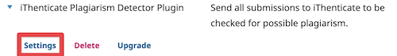

# iThenticate Plagiarism Detector Plugin

For OJS/OMP/OPS 4.x

## Overview

This plugin permits automatic or manual submission of uploaded manuscripts to the [iThenticate service](http://www.ithenticate.com/) for plagiarism checking. 

1. You need an account on ithenticate.com (costs involved)
   * paid via Crossref Similarity Check
   * or, paid directly to iThenticate
2. Configure the API credentials following this [guide](https://help.turnitin.com/ithenticate/administrator/api-custom.htm)
3. Install the plugin via the Plugin Gallery
4. Configure the plugin (see below)
   * Enable the iThenticate service from `config.inc.php` by setting `ithenticate` to `On`.
   * Enable the plugin from Plugin Gallery by clicking on the checkbox. 
   * 
   * Configure the plugin with the **API URL** and **API KEY** you get from ithenticate.com at plugin's setting page or in the config file.
   * 
5. The author logs in and makes a submission
   * At Step 4 of the submission process, submitting user must confirm iThenticate's End User License Agreement to complete the submission.
   * The submission files will be sent to iThenticate in Step 4 of the submission process.
6. The Editor logs in to OJS/OMP/OPS installation and opens the Submission workflow page.
   * In the submission files grid view, the Editor can see the similarity scores if the similarity process has completed.
   * The Editor can also launch iThenticate's similarity viewer.
7. If auto upload to iThenticate is disabled, the Editor can send each submission file to iThenticate from the workflow stage.

## Similarity Check Settings

There are several iThenticate similarity check settings that can be configured via the plugin.
1. Similarity Check Options
   * `addToIndex` -- Submissions will be indexed in the accounts repository and will be available for comparison in Similarity Reports by other users within your organization
   * `excludeQuotes` -- Text in quotes of the submission will not count as similar content
   * `excludeBibliography` -- Text in a bibliography section of the submission will not count as similar content
   * `excludeAbstract` -- Text in the abstract section of the submission will not count as similar content
   * `excludeMethods` -- Text in the method section of the submission will not count as similar content
   * `excludeCitations` -- The citations of the submission will be excluded from similarity check
   * `excludeSmallMatches` -- Similarity matches that match less than the specified amount of words will not count as similar content. Minimum value is 8.
   * `allowViewerUpdate` -- Changes made in reports will be saved for the next time the report is viewed
   * 
2. Each of this settings can also be configured at global or Journal/Press/Server level from the `config.inc.php` file.

## Configuration

You may set the credentials in config.inc.php, or you may set the credentials per journal/press/server in the plugin settings.  If credentials are present in config.inc.php, they will override those entered in the plugin settings form.

The config.inc.php settings format is:

```
;;;;;;;;;;;;;;;;;;;;;;;;;;;;;;;
; iThenticate Plugin Settings ;
;;;;;;;;;;;;;;;;;;;;;;;;;;;;;;;

[ithenticate]

; Enable/Disable iThenticate service to upload submission files for plagiarism checking.
; Unsetting this will turn off the plugin globally.
ithenticate = On

; Global iThenticate API URL
; api_url = "https://some-ithenticate-account.com"

; Global iThenticate API key
; api_key = "YOUR_API_KEY"

; If desired, credentials can also be set by context by specifying each Journal/Server/Press path.
; api_url[Journal_or_Server_or_Press_path] = "https://some-ithenticate-account.com"
; api_key[Journal_or_Server_or_Press_path] = "YOUR_API_KEY"

; To globally disable auto upload of submission files to iThenticate service, uncomment following line.
; disableAutoSubmission = On
; It is possible to disable auto upload at specific Journal/Server/Press level rather than globally
; disableAutoSubmission[Journal_or_Server_or_Press_path] = On

; Other settings can be configured here; see README.md for all options.
```

## Webhook Management

When you update(after initial configuration) iThenticate API credentials in `config.inc.php`, webhooks need to be registered with iThenticate to receive plagiarism check results automatically.

### Important Notes

**After changing API credentials** (`api_url` and/or `api_key`) in `config.inc.php`:
- Webhooks are **not updated automatically**
- You must update webhooks using the CLI tool (see below)
- Without updating webhooks, similarity score results will not be received automatically

### Webhook CLI Tool

The webhook command-line tool helps you manage iThenticate webhooks for your contexts.

**Basic Usage:**

```bash
# Register webhooks for a specific journal/press/server
php plugins/generic/plagiarism/tools/webhook.php register --context=yourcontextpath

# Update existing webhooks (useful after changing API credentials), use --force to force update
php plugins/generic/plagiarism/tools/webhook.php update --context=yourcontextpath

# Validate webhook configuration
php plugins/generic/plagiarism/tools/webhook.php validate --context=yourcontextpath

# List all configured webhooks
php plugins/generic/plagiarism/tools/webhook.php list
```

**When to use:**
- After changing `api_url` or `api_key` in `config.inc.php`
- To verify webhook configuration is working correctly
- To troubleshoot similarity score delivery issues

**Finding your context path:**
- From `Administration --> Hosted Journals --> Settings Wizard `
- Or use the context ID number instead of the path

## Restrictions
1. The submitting user must confirm the iThenticate End User License Agreement to send files to iThenticate service for plagiarism checking.
2. zip/tar/gzip files will not be uploaded to iThenticate.
3. Uploading files larger than 100 MB will cause failure as per iThenticate limits.
